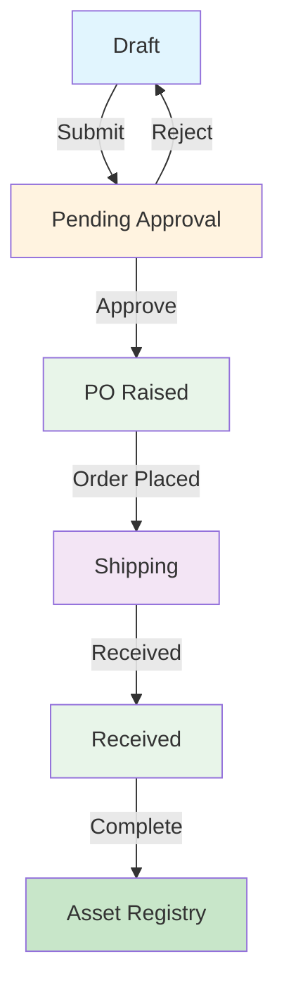
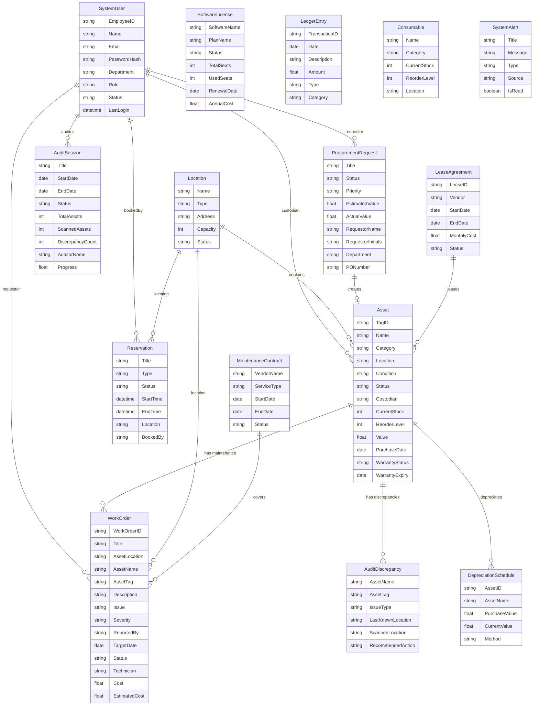
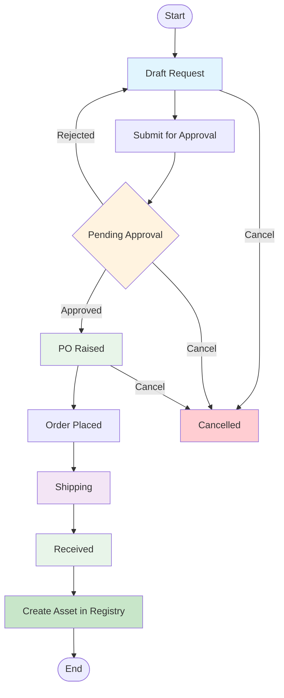
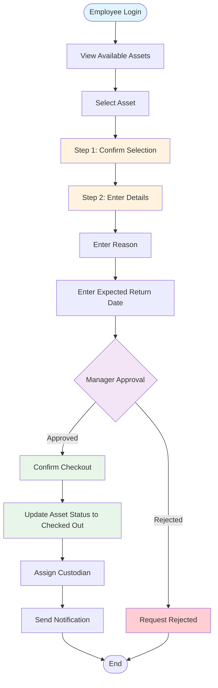
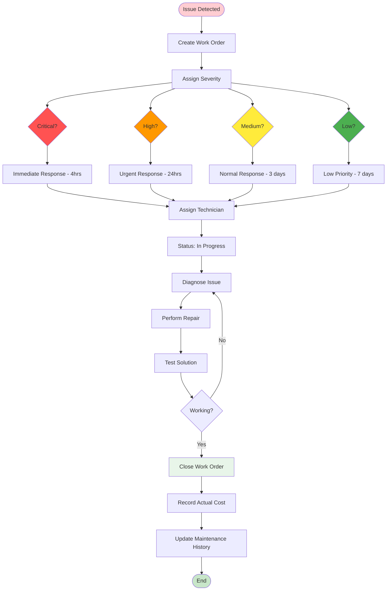
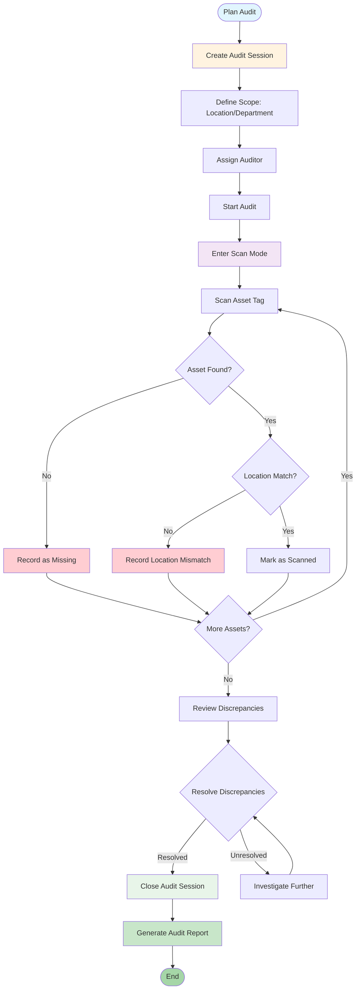

# Software Requirements Specification (SRS)
## TASM - Asset Management System

---

## Table of Contents

1. [Introduction](#1-introduction)
   - 1.1 [Purpose](#11-purpose)
   - 1.2 [Scope](#12-scope)
   - 1.3 [Definitions, Acronyms, and Abbreviations](#13-definitions-acronyms-and-abbreviations)
   - 1.4 [References](#14-references)
   - 1.5 [Overview](#15-overview)

2. [Overall Description](#2-overall-description)
   - 2.1 [Product Perspective](#21-product-perspective)
   - 2.2 [Product Functions](#22-product-functions)
   - 2.3 [User Characteristics](#23-user-characteristics)
   - 2.4 [Constraints](#24-constraints)
   - 2.5 [Assumptions and Dependencies](#25-assumptions-and-dependencies)

3. [Functional Requirements](#3-functional-requirements)
   - 3.1 [Asset Registry Management](#31-asset-registry-management-fr-1)
   - 3.2 [Consumables & Supplies Tracking](#32-consumables--supplies-tracking-fr-2)
   - 3.3 [Work Order & Maintenance Management](#33-work-order--maintenance-management-fr-3)
   - 3.4 [Procurement Pipeline](#34-procurement-pipeline-fr-4)
   - 3.5 [Audit Management](#35-audit-management-fr-5)
   - 3.6 [Financial Management](#36-financial-management-fr-6)
   - 3.7 [Software License Management](#37-software-license-management-fr-7)
   - 3.8 [Reservations & Bookings](#38-reservations--bookings-fr-8)
   - 3.9 [User Management & RBAC](#39-user-management--rbac-fr-9)
   - 3.10 [Location Management](#310-location-management-fr-10)
   - 3.11 [Alerts & Notifications](#311-alerts--notifications-fr-11)
   - 3.12 [Reports & Analytics](#312-reports--analytics-fr-12)
   - 3.13 [Employee Self-Service Portal](#313-employee-self-service-portal-fr-13)

4. [Non-Functional Requirements](#4-non-functional-requirements)
   - 4.1 [Performance Requirements](#41-performance-requirements-nfr-1)
   - 4.2 [Security Requirements](#42-security-requirements-nfr-2)
   - 4.3 [Reliability Requirements](#43-reliability-requirements-nfr-3)
   - 4.4 [Usability Requirements](#44-usability-requirements-nfr-4)
   - 4.5 [Scalability Requirements](#45-scalability-requirements-nfr-5)
   - 4.6 [Maintainability Requirements](#46-maintainability-requirements-nfr-6)
   - 4.7 [Compatibility Requirements](#47-compatibility-requirements-nfr-7)

5. [Data Models & Business Rules](#5-data-models--business-rules)
   - 5.1 [Entity-Relationship Diagram](#51-entity-relationship-diagram)
   - 5.2 [Database Schema](#52-database-schema)
   - 5.3 [Business Rules](#53-business-rules)

6. [External Interfaces](#6-external-interfaces)
   - 6.1 [User Interfaces](#61-user-interfaces)
   - 6.2 [API Interfaces](#62-api-interfaces)
   - 6.3 [Hardware Interfaces](#63-hardware-interfaces)
   - 6.4 [Software Interfaces](#64-software-interfaces)

7. [Workflow Diagrams](#7-workflow-diagrams)
   - 7.1 [Procurement Workflow](#71-procurement-workflow)
   - 7.2 [Asset Checkout Workflow](#72-asset-checkout-workflow)
   - 7.3 [Maintenance Workflow](#73-maintenance-workflow)
   - 7.4 [Audit Workflow](#74-audit-workflow)

8. [Appendices](#8-appendices)
   - 8.1 [Use Case Matrix](#81-use-case-matrix)
   - 8.2 [Traceability Matrix](#82-traceability-matrix)

---

## 1. Introduction

### 1.1 Purpose

The purpose of this Software Requirements Specification (SRS) is to provide a comprehensive description of the **TASM (Asset Management System)**. This document details the functional and non-functional requirements for the system, which is designed to manage IT and infrastructure assets across a campus or organizational environment (e.g., Technopark).

The intended audience includes:
- **Project Stakeholders:** Management team, decision-makers
- **Development Team:** Software engineers, UI/UX designers, QA engineers
- **System Administrators:** IT staff responsible for deployment and maintenance
- **End Users:** Employees, facilities staff, finance managers

### 1.2 Scope

TASM is a comprehensive web-based Asset Management System that provides:

**Core Capabilities:**
- Complete asset lifecycle management from procurement to disposal
- Financial tracking including depreciation calculations and lease management
- Maintenance operations with work orders and service contract management
- Audit compliance with discrepancy tracking and resolution
- Employee self-service portal for asset checkout and reservations
- Real-time alerts and notifications for critical events
- Advanced reporting and analytics dashboard

**System Boundaries:**
- **In-Scope:** Asset registration, tracking, allocation, maintenance, procurement, audit, financial management, software license tracking, reservations, user management, reporting
- **Out-of-Scope:** Payroll integration, external accounting system synchronization (beyond export), mobile native applications (mobile-web responsive only)

**Benefits:**
- Reduced asset loss through systematic tracking
- Improved maintenance scheduling and cost control
- Enhanced audit compliance and accountability
- Streamlined procurement processes
- Real-time visibility into asset status and location

### 1.3 Definitions, Acronyms, and Abbreviations

| Term | Definition |
|------|------------|
| **TASM** | Technopark Asset Management System |
| **SRS** | Software Requirements Specification |
| **CRUD** | Create, Read, Update, Delete |
| **RBAC** | Role-Based Access Control |
| **JWT** | JSON Web Token |
| **ORM** | Object-Relational Mapping |
| **SPA** | Single Page Application |
| **API** | Application Programming Interface |
| **PO** | Purchase Order |
| **IT** | Information Technology |
| **E2E** | End-to-End (testing) |
| **CI/CD** | Continuous Integration/Continuous Deployment |
| **GORM** | Go Object Relational Mapping library |
| **Pinia** | Vue.js state management library |
| **PrimeVue** | Vue UI component library |

### 1.4 References

| Document | Source |
|----------|--------|
| IEEE 830-1998 | Recommended Practice for Software Requirements Specifications |
| TASM Codebase | `/home/anuruprkris/Project/TASM/` (backend and frontend repositories) |
| Vue 3 Documentation | https://vuejs.org/ |
| Gin Web Framework | https://gin-gonic.com/ |
| GORM Documentation | https://gorm.io/ |
| PostgreSQL 15 Documentation | https://www.postgresql.org/docs/15/ |
| Docker Documentation | https://docs.docker.com/ |

### 1.5 Overview

The remainder of this document is organized as follows:
- **Section 2** provides an overall description of the system, including product perspective, functions, user characteristics, and constraints.
- **Section 3** details all functional requirements organized by module.
- **Section 4** specifies non-functional requirements including performance, security, and reliability.
- **Section 5** presents data models, ER diagrams, and business rules.
- **Section 6** describes external interfaces.
- **Section 7** includes workflow diagrams for key business processes.
- **Section 8** contains appendices with traceability matrices.

---

## 2. Overall Description

### 2.1 Product Perspective

TASM is a comprehensive web-based Asset Management System designed to operate within an organization's intranet or cloud infrastructure. The system provides end-to-end management of organizational assets, integrating all aspects of asset lifecycle from procurement to disposal, maintenance, financial tracking, and audit compliance.

The system is accessible via standard web browsers with no client-side software installation required, providing a responsive interface for both desktop and mobile users.

### 2.2 Product Functions

The system provides the following major functions:

| Function ID | Function Name | Description |
|-------------|---------------|-------------|
| PF-01 | Asset Registry | Central database of all assets with CRUD operations, search, filter, and export |
| PF-02 | Consumables Tracking | Track consumable inventory with reorder level alerts |
| PF-03 | Work Order Management | Create, assign, and track maintenance work orders |
| PF-04 | Maintenance Contracts | Manage vendor service agreements and renewals |
| PF-05 | Procurement Pipeline | Purchase request workflow from draft to receipt |
| PF-06 | Audit Management | Conduct asset audits with discrepancy tracking |
| PF-07 | Financial Ledger | Track financial transactions (debit/credit) |
| PF-08 | Lease Management | Manage equipment leases with cost tracking |
| PF-09 | Depreciation Tracking | Calculate and track asset depreciation |
| PF-10 | Software License Management | Track license seats and renewal dates |
| PF-11 | Reservations & Bookings | Book assets, rooms, and vehicles |
| PF-12 | User Management | User accounts, roles, and permissions |
| PF-13 | Location Management | Manage campus facilities and locations |
| PF-14 | Alerts & Notifications | System alerts for critical events |
| PF-15 | Reports & Analytics | Custom reports and KPI dashboards |
| PF-16 | Self-Service Portal | Employee asset checkout and reservations |

### 2.3 User Characteristics

| User Role | Description | Technical Expertise | Privileges |
|-----------|-------------|---------------------|------------|
| **System Admin** | Full system access, configuration, user management | High | All modules, system settings, user administration |
| **Finance Manager** | Financial oversight, budget tracking | Medium | Ledgers, depreciation, lease agreements, financial reports |
| **Facilities Head** | Operations management, maintenance oversight | Medium | Asset registry, maintenance, work orders, audit |
| **Employee** | End user, asset consumer | Low | Self-service portal, asset checkout, reservations, view own assets |

**User Demographics (from seed data):**
- Total Users: 245+ employees
- Departments: Multiple (IT, HR, Finance, Facilities, etc.)
- Usage Pattern: Daily for self-service, Weekly for management functions

### 2.4 Constraints

| Constraint Type | Description |
|-----------------|-------------|
| **Security** | Session tokens expire after 24 hours; passwords must be stored using secure one-way hashing |
| **Regulatory** | Audit trails must be maintained for compliance; deleted data is retained for audit purposes |
| **Browser** | Modern web browsers (Chrome 90+, Firefox 88+, Edge 90+, Safari 14+) |
| **Mobile** | Responsive web design; no native mobile apps (iOS/Android) |

### 2.5 Assumptions

1. Organization has a stable network infrastructure
2. Users have basic computer literacy
3. Asset tags/labels are physically attached to assets for audit scanning
4. Email server is available for notifications (future enhancement)

---

## 3. Functional Requirements

### 3.1 Asset Registry Management (FR-1)

#### 3.1.1 Description
The Asset Registry module serves as the central database for all organizational assets, providing complete CRUD operations and lifecycle tracking.

#### 3.1.2 Functional Requirements

| ID | Requirement | Priority | Description |
|----|-------------|----------|-------------|
| FR-1.1 | Create Asset | High | System shall allow authorized users to add new assets with details: Name, Tag ID, Category, Location, Custodian, Value, Purchase Date, Warranty Status, Warranty Expiry |
| FR-1.2 | Read Asset List | High | System shall display all assets in a searchable, filterable list view with pagination |
| FR-1.3 | Read Asset Details | High | System shall display complete asset details including: current status, custodian history, maintenance history, audit history |
| FR-1.4 | Update Asset | High | System shall allow modification of asset details by authorized users |
| FR-1.5 | Delete Asset | Medium | System shall support soft deletion of assets (marked as deleted, not physically removed) |
| FR-1.6 | Search Assets | High | System shall provide search functionality by: Name, Tag ID, Category, Custodian, Location |
| FR-1.7 | Filter Assets | High | System shall allow filtering by: Status (In Stock, Checked Out, Under Repair, Reserved), Category, Location, Warranty Status |
| FR-1.8 | Export Assets | Medium | System shall allow exporting asset list to CSV format |
| FR-1.9 | Asset Categories | High | System shall support asset categorization: IT Equipment, IT Peripherals, Office Furniture, Infrastructure |
| FR-1.10 | Asset Status Tracking | High | System shall track asset status changes with timestamps and user attribution |

#### 3.1.3 Asset Status Workflow

```
                    ┌─────────────┐
                    │  In Stock   │
                    └──────┬──────┘
                           │
              ┌────────────┼────────────┐
              │            │            │
              ▼            ▼            ▼
        ┌──────────┐ ┌──────────┐ ┌──────────┐
        │ Checked  │ │ Reserved │ │ Under    │
        │  Out     │ │          │ │ Repair   │
        └────┬─────┘ └────┬─────┘ └────┬─────┘
             │            │            │
             └────────────┼────────────┘
                          │
                          ▼
                    ┌─────────────┐
                    │  In Stock   │
                    └─────────────┘
```

### 3.2 Consumables & Supplies Tracking (FR-2)

#### 3.2.1 Description
Track consumable inventory items with automated reorder level alerts.

#### 3.2.2 Functional Requirements

| ID | Requirement | Priority | Description |
|----|-------------|----------|-------------|
| FR-2.1 | Add Consumable | High | System shall allow adding consumable items with: Name, Category, Current Stock, Reorder Level, Location |
| FR-2.2 | Update Stock | High | System shall allow updating stock levels (increment/decrement) with reason tracking |
| FR-2.3 | Reorder Alert | High | System shall generate alerts when Current Stock falls below Reorder Level |
| FR-2.4 | Stockroom View | Medium | System shall provide a stockroom inventory view with location-based organization |
| FR-2.5 | Consumable Categories | Medium | System shall support categorization of consumables (Office Supplies, IT Supplies, Cleaning Supplies, etc.) |
| FR-2.6 | Usage Tracking | Low | System shall track consumable usage history with user and date attribution |

### 3.3 Work Order & Maintenance Management (FR-3)

#### 3.3.1 Description
Manage maintenance tasks through work orders with severity levels and status tracking.

#### 3.3.2 Functional Requirements

| ID | Requirement | Priority | Description |
|----|-------------|----------|-------------|
| FR-3.1 | Create Work Order | High | System shall allow creating work orders with: Title, Asset/Location, Issue Description, Severity, Target Date, Assigned Technician |
| FR-3.2 | Update Work Order | High | System shall allow updating work order details, status, and cost |
| FR-3.3 | Work Order Severity | High | System shall support severity levels: Critical, High, Medium, Low |
| FR-3.4 | Work Order Status | High | System shall track status: Open, In Progress, Closed |
| FR-3.5 | Assign Technician | Medium | System shall allow assigning work orders to specific technicians |
| FR-3.6 | Work Order Cost | Medium | System shall track actual costs incurred for completed work orders |
| FR-3.7 | Maintenance History | High | System shall maintain a complete service history log for each asset |
| FR-3.8 | Scheduled Maintenance | Medium | System shall support scheduling recurring maintenance tasks |
| FR-3.9 | Maintenance Contracts | High | System shall manage vendor service agreements with: Vendor Name, Service Type, Start/End Dates, Status |
| FR-3.10 | Contract Renewal Alert | Medium | System shall generate alerts for contracts nearing expiry |

#### 3.3.3 Work Order Severity Matrix

| Severity | Response Time | Example |
|----------|---------------|---------|
| Critical | 4 hours | Server down, Network outage |
| High | 24 hours | Printer malfunction, Workstation failure |
| Medium | 3 days | Software issue, Peripheral repair |
| Low | 7 days | Cosmetic damage, Non-urgent requests |

### 3.4 Procurement Pipeline (FR-4)

#### 3.4.1 Description
Manage purchase requests through a structured workflow from draft to receipt.

#### 3.4.2 Functional Requirements

| ID | Requirement | Priority | Description |
|----|-------------|----------|-------------|
| FR-4.1 | Create Procurement Request | High | System shall allow creating purchase requests with: Title, Description, Estimated Value, Priority, Department, Requestor |
| FR-4.2 | Procurement Workflow | High | System shall enforce workflow: Draft → Pending Approval → PO Raised → Shipping → Received |
| FR-4.3 | Approval Process | High | System shall require manager approval before PO Raised state |
| FR-4.4 | Priority Levels | Medium | System shall support priority: Low, Medium, High |
| FR-4.5 | PO Number Tracking | Medium | System shall allow linking requests to Purchase Order numbers |
| FR-4.6 | Actual Value Tracking | Medium | System shall track actual costs vs estimated costs |
| FR-4.7 | Department Tracking | Medium | System shall associate requests with departments |
| FR-4.8 | Procurement Reports | Low | System shall generate procurement pipeline reports |

#### 3.4.3 Procurement Workflow Diagram



### 3.5 Audit Management (FR-5)

#### 3.5.1 Description
Conduct asset audits with discrepancy tracking and resolution.

#### 3.5.2 Functional Requirements

| ID | Requirement | Priority | Description |
|----|-------------|----------|-------------|
| FR-5.1 | Create Audit Session | High | System shall allow creating audit sessions with: Title, Start/End Date, Auditor Name, Scope (Location/Department) |
| FR-5.2 | Audit Progress Tracking | High | System shall track progress: Scanned Assets vs Total Assets, Discrepancy Count |
| FR-5.3 | Mobile Scan Mode | High | System shall provide a mobile-friendly interface for scanning asset tags |
| FR-5.4 | Discrepancy Recording | High | System shall record discrepancies: Missing Assets, Location Mismatches, Unregistered Assets |
| FR-5.5 | Discrepancy Resolution | High | System shall allow resolving discrepancies with: Resolution Action, Resolved By, Resolution Date |
| FR-5.6 | Audit Reports | Medium | System shall generate audit summary reports with discrepancy details |
| FR-5.7 | Audit History | Medium | System shall maintain history of all audit sessions |

#### 3.5.3 Discrepancy Types

| Issue Type | Description | Recommended Action |
|------------|-------------|-------------------|
| Missing | Asset not found during audit | Investigate, mark as lost/stolen |
| Location Mismatch | Asset found at different location | Update location, investigate unauthorized move |
| Unregistered | Unknown asset found | Register asset, investigate source |
| Custodian Mismatch | Asset assigned to different user | Update custodian, verify authorization |

### 3.6 Financial Management (FR-6)

#### 3.6.1 Description
Track financial aspects of assets including ledgers, leases, and depreciation.

#### 3.6.2 Functional Requirements

| ID | Requirement | Priority | Description |
|----|-------------|----------|-------------|
| FR-6.1 | General Ledger | High | System shall maintain financial transactions with: Transaction ID, Date, Description, Amount, Type (Debit/Credit), Category |
| FR-6.2 | Lease Agreements | High | System shall manage leases with: Lease ID, Vendor, Start/End Dates, Monthly Cost, Status |
| FR-6.3 | Depreciation Calculation | High | System shall calculate depreciation using: Straight Line or Declining Balance methods |
| FR-6.4 | Depreciation Schedule | High | System shall generate depreciation schedules showing: Purchase Value, Current Value, Depreciation Method |
| FR-6.5 | Financial Reports | Medium | System shall generate financial analytics dashboards |
| FR-6.6 | Lease Cost Tracking | Medium | System shall track total lease costs and upcoming payments |
| FR-6.7 | Budget Tracking | Low | System shall compare actual spending against budget (future enhancement) |

#### 3.6.3 Depreciation Methods

**Straight Line Method:**
```
Annual Depreciation = (Purchase Value - Salvage Value) / Useful Life
Monthly Depreciation = Annual Depreciation / 12
```

**Declining Balance Method:**
```
Depreciation = Current Book Value × (Depreciation Rate)
```

### 3.7 Software License Management (FR-7)

#### 3.7.1 Description
Track software licenses, seat usage, and renewal dates.

#### 3.7.2 Functional Requirements

| ID | Requirement | Priority | Description |
|----|-------------|----------|-------------|
| FR-7.1 | License Registry | High | System shall maintain software licenses with: Software Name, Plan Name, Total Seats, Used Seats, Renewal Date, Annual Cost |
| FR-7.2 | Seat Tracking | High | System shall track seat utilization (Total Seats vs Used Seats) |
| FR-7.3 | Renewal Alerts | High | System shall generate alerts for licenses nearing expiry |
| FR-7.4 | License Status | Medium | System shall track status: Active, Expiring Soon (≤30 days), Expired |
| FR-7.5 | Cost Analysis | Low | System shall calculate total annual software costs |

### 3.8 Reservations & Bookings (FR-8)

#### 3.8.1 Description
Allow booking of assets, meeting rooms, and vehicles.

#### 3.8.2 Functional Requirements

| ID | Requirement | Priority | Description |
|----|-------------|----------|-------------|
| FR-8.1 | Create Reservation | High | System shall allow creating reservations with: Title, Type, Start/End Time, Location, Booked By |
| FR-8.2 | Resource Types | High | System shall support: Meeting Rooms, Vehicles, AV Equipment |
| FR-8.3 | Availability Check | High | System shall prevent double-booking by checking availability |
| FR-8.4 | Reservation Status | Medium | System shall track status: Active, Upcoming, Completed, Cancelled |
| FR-8.5 | Cancel Reservation | Medium | System shall allow cancelling reservations with reason |
| FR-8.6 | Reservation History | Low | System shall maintain booking history for audit purposes |

### 3.9 User Management & RBAC (FR-9)

#### 3.9.1 Description
Manage user accounts, roles, and permissions using Role-Based Access Control.

#### 3.9.2 Functional Requirements

| ID | Requirement | Priority | Description |
|----|-------------|----------|-------------|
| FR-9.1 | User Registration | High | System shall allow adding users with: Employee ID, Name, Email, Department, Role |
| FR-9.2 | User Authentication | High | System shall authenticate users via email and password with JWT token generation |
| FR-9.3 | Password Hashing | High | System shall hash passwords using bcrypt before storage |
| FR-9.4 | Role Assignment | High | System shall assign users to roles: System Admin, Finance Manager, Facilities Head, Employee |
| FR-9.5 | User Status | Medium | System shall track user status: Active, Inactive |
| FR-9.6 | Last Login Tracking | Medium | System shall record last login timestamp for each user |
| FR-9.7 | Department Association | Medium | System shall associate users with departments |
| FR-9.8 | User Update | Medium | System shall allow updating user details (excluding password) |
| FR-9.9 | User Deactivation | Medium | System shall allow deactivating users (soft delete) |

#### 3.9.3 Role Permissions Matrix

| Module | System Admin | Finance Manager | Facilities Head | Employee |
|--------|-------------|-----------------|-----------------|----------|
| Asset Registry | Full | View | Full | View Own |
| Consumables | Full | View | Full | View |
| Work Orders | Full | View | Full | View Own |
| Procurement | Full | Approve | View | Create Own |
| Audit | Full | View | Full | None |
| Financial | Full | Full | View | None |
| Software Licenses | Full | Full | View | None |
| Reservations | Full | View | View | Create Own |
| User Management | Full | None | None | None |
| Locations | Full | None | Full | None |
| Reports | Full | Full | Full | View Own |

### 3.10 Location Management (FR-10)

#### 3.10.1 Description
Manage campus facilities, offices, data centers, and warehouses.

#### 3.10.2 Functional Requirements

| ID | Requirement | Priority | Description |
|----|-------------|----------|-------------|
| FR-10.1 | Add Location | High | System shall allow adding locations with: Name, Type, Address, Capacity, Status |
| FR-10.2 | Location Types | High | System shall support types: Office, Data Center, Warehouse |
| FR-10.3 | Location Status | Medium | System shall track status: Active, Inactive |
| FR-10.4 | Capacity Tracking | Low | System shall track asset count per location vs capacity |

### 3.11 Alerts & Notifications (FR-11)

#### 3.11.1 Description
Generate and manage system alerts for critical events.

#### 3.11.2 Functional Requirements

| ID | Requirement | Priority | Description |
|----|-------------|----------|-------------|
| FR-11.1 | Alert Generation | High | System shall generate alerts for: Warranty Expiry, Lease Expiry, Contract Expiry, License Expiry, Low Stock, Audit Discrepancies |
| FR-11.2 | Alert Types | High | System shall categorize alerts: Critical, Warning, Info |
| FR-11.3 | Alert Sources | Medium | System shall track alert source: Asset Management, Maintenance, Inventory, Financial |
| FR-11.4 | Mark as Read | Medium | System shall allow users to acknowledge alerts (mark as read) |
| FR-11.5 | Alert Center | Medium | System shall provide a centralized alert notification center |
| FR-11.6 | Unread Count | Low | System shall display unread alert count in UI |

### 3.12 Reports & Analytics (FR-12)

#### 3.12.1 Description
Generate custom reports and display analytics dashboards.

#### 3.12.2 Functional Requirements

| ID | Requirement | Priority | Description |
|----|-------------|----------|-------------|
| FR-12.1 | Dashboard KPIs | High | System shall display: Total Assets, Operational Health %, Maintenance Queue, Total Asset Value |
| FR-12.2 | Financial Analytics | High | System shall display spending analysis, budget tracking, depreciation trends |
| FR-12.3 | Custom Report Builder | Medium | System shall allow users to create custom reports with field selection and filters |
| FR-12.4 | Asset Reports | Medium | System shall generate reports: Asset List, Asset Valuation, Asset by Category/Location |
| FR-12.5 | Maintenance Reports | Medium | System shall generate: Work Order Summary, Maintenance Costs, MTTR (Mean Time To Repair) |
| FR-12.6 | Export Reports | Medium | System shall allow exporting reports to CSV/PDF formats |
| FR-12.7 | Visual Charts | Low | System shall display data using bar charts, pie charts, line graphs |

### 3.13 Employee Self-Service Portal (FR-13)

#### 3.13.1 Description
Provide employees with a portal to view and request assets.

#### 3.13.2 Functional Requirements

| ID | Requirement | Priority | Description |
|----|-------------|----------|-------------|
| FR-13.1 | View Own Assets | High | System shall display assets currently assigned to the logged-in employee |
| FR-13.2 | Asset Checkout | High | System shall provide a multi-step checkout flow for requesting assets |
| FR-13.3 | Checkout Step 1 | High | System shall allow selecting asset type and specific asset |
| FR-13.4 | Checkout Step 2 | High | System shall collect: Checkout Reason, Expected Return Date, Manager Approval |
| FR-13.5 | Checkout Confirmation | High | System shall confirm checkout and update asset status to "Checked Out" |
| FR-13.6 | View Reservations | Medium | System shall display employee's active and upcoming reservations |
| FR-13.7 | Request Consumables | Low | System shall allow requesting consumable items from stockroom |

---

## 4. Non-Functional Requirements

### 4.1 Performance Requirements (NFR-1)

| ID | Requirement | Description | Target Metric |
|----|-------------|-------------|---------------|
| NFR-1.1 | Page Load Time | System shall load pages within acceptable time | < 2 seconds for initial load, < 500ms for subsequent navigation |
| NFR-1.2 | API Response Time | Backend API shall respond within acceptable time | < 200ms for simple queries, < 1 second for complex reports |
| NFR-1.3 | Database Query Performance | Database queries shall execute efficiently | < 100ms for indexed queries, < 500ms for full table scans |
| NFR-1.4 | Concurrent Users | System shall support multiple concurrent users | Minimum 100 concurrent users without performance degradation |
| NFR-1.5 | Asset List Loading | Asset list with pagination shall load quickly | < 1 second for 100 records with filters |
| NFR-1.6 | Search Performance | Search operations shall return results quickly | < 500ms for search across 10,000 assets |
| NFR-1.7 | Report Generation | Report generation shall complete in reasonable time | < 5 seconds for standard reports, < 30 seconds for complex custom reports |

### 4.2 Security Requirements (NFR-2)

| ID | Requirement | Description |
|----|-------------|-------------|
| NFR-2.1 | Authentication | System shall authenticate users via email and password before granting access, using secure token-based authentication with 24-hour token expiry |
| NFR-2.2 | Password Storage | System shall store passwords using secure one-way hashing algorithms |
| NFR-2.3 | Authorization | System shall enforce role-based access control (RBAC) for all protected functions |
| NFR-2.4 | Token Transmission | System shall transmit authentication tokens securely via standard HTTP headers |
| NFR-2.5 | Input Validation | System shall validate all user inputs on both client and server sides |
| NFR-2.6 | Data Retention | System shall retain deleted data for audit purposes, preventing permanent accidental deletion |
| NFR-2.7 | XSS Prevention | System shall prevent cross-site scripting attacks through automatic output escaping |
| NFR-2.8 | SQL Injection Prevention | System shall prevent SQL injection attacks through parameterized queries |

### 4.3 Reliability Requirements (NFR-3)

| ID | Requirement | Description | Target Metric |
|----|-------------|-------------|---------------|
| NFR-3.1 | System Availability | System shall be available during business hours | 99.5% uptime during business hours (8 AM - 8 PM) |
| NFR-3.2 | Data Backup | System data shall be backed up regularly | Daily automated backups (to be configured) |
| NFR-3.3 | Error Handling | System shall handle errors gracefully | User-friendly error messages, no stack traces to users |
| NFR-3.4 | Monitoring | System shall be monitored for health and performance | Prometheus metrics at /metrics endpoint, Grafana dashboards |
| NFR-3.5 | Health Check | System shall provide health check endpoint | /healthz endpoint for liveness probes |
| NFR-3.6 | Fault Tolerance | System shall recover from transient failures | Docker restart policies, database connection retry |

### 4.4 Usability Requirements (NFR-4)

| ID | Requirement | Description | Criteria |
|----|-------------|-------------|----------|
| NFR-4.1 | Responsive Design | System shall work on desktop and mobile browsers | Responsive layout using TailwindCSS, mobile scan mode for audits |
| NFR-4.2 | Intuitive Navigation | System shall have clear, consistent navigation | Vue Router with protected routes, breadcrumbs |
| NFR-4.3 | User Feedback | System shall provide feedback for user actions | Toast notifications via PrimeVue Toast component |
| NFR-4.4 | Error Messages | System shall display clear error messages | Descriptive error messages with suggested actions |
| NFR-4.5 | Loading Indicators | System shall show loading state during async operations | PrimeVue ProgressSpinner, skeleton loaders |
| NFR-4.6 | Accessibility | System shall be accessible to users with disabilities | WCAG 2.1 Level A compliance (future enhancement) |
| NFR-4.7 | Consistent UI | System shall have consistent look and feel | PrimeVue component library, TailwindCSS utilities |

### 4.5 Compatibility Requirements (NFR-5)

| ID | Requirement | Description | Supported Versions |
|----|-------------|-------------|-------------------|
| NFR-5.1 | Browser Compatibility | System shall work on modern desktop and mobile browsers | Chrome 90+, Firefox 88+, Edge 90+, Safari 14+ |
| NFR-5.2 | Mobile Browsers | System shall work on mobile browsers | iOS Safari 14+, Chrome Android 90+ |
| NFR-5.3 | Screen Resolution | System shall support common desktop, mobile, and tablet resolutions | 1920x1080 (desktop), 375x667 (mobile), 768x1024 (tablet) |

---

## 5. Data Models & Business Rules

### 5.1 Entity-Relationship Diagram



### 5.3 Business Rules

#### 5.3.1 Asset Management Rules

| Rule ID | Rule | Description |
|---------|------|-------------|
| BR-1.1 | Unique Tag ID | Each asset must have a unique Tag ID within the system |
| BR-1.2 | Status Transition | Asset status can only transition through valid states (see Section 3.1.3) |
| BR-1.3 | Custodian Assignment | Only active employees can be assigned as custodians |
| BR-1.4 | Warranty Tracking | Warranty status auto-updates based on warranty_expiry date |
| BR-1.5 | Asset Value | Asset value must be positive (greater than zero) |

#### 5.3.2 Procurement Rules

| Rule ID | Rule | Description |
|---------|------|-------------|
| BR-2.1 | Workflow Enforcement | Procurement status must follow: Draft → Pending Approval → PO Raised → Shipping → Received |
| BR-2.2 | Approval Required | Status cannot move to "PO Raised" without manager approval |
| BR-2.3 | PO Number | PO Number is required when status is "PO Raised" |
| BR-2.4 | Actual Value | Actual value should be recorded when status is "Received" |

#### 5.3.3 Maintenance Rules

| Rule ID | Rule | Description |
|---------|------|-------------|
| BR-3.1 | Severity Assignment | Work orders must have a severity level assigned |
| BR-3.2 | Target Date | Target date cannot be in the past for new work orders |
| BR-3.3 | Cost Recording | Cost can only be recorded for "Closed" work orders |
| BR-3.4 | Technician Assignment | Work orders should be assigned to a technician when status is "In Progress" |

#### 5.3.4 Audit Rules

| Rule ID | Rule | Description |
|---------|------|-------------|
| BR-4.1 | Audit Scope | Audit sessions must have a defined scope (location/department) |
| BR-4.2 | Progress Calculation | Progress = (ScannedAssets / TotalAssets) × 100 |
| BR-4.3 | Discrepancy Resolution | Discrepancies must be resolved before audit session can be closed |
| BR-4.4 | Auditor Assignment | Only authorized users (Facilities Head, System Admin) can conduct audits |

#### 5.3.5 Financial Rules

| Rule ID | Rule | Description |
|---------|------|-------------|
| BR-5.1 | Transaction Type | Ledger entries must be either "Debit" or "Credit" |
| BR-5.2 | Lease Status | Lease status auto-updates based on end date (Active vs Expired) |
| BR-5.3 | Depreciation Method | Depreciation method must be "Straight Line" or "Declining Balance" |
| BR-5.4 | Positive Values | All financial amounts must be positive |

#### 5.3.6 User Management Rules

| Rule ID | Rule | Description |
|---------|------|-------------|
| BR-6.1 | Unique Email | Each user must have a unique email address |
| BR-6.2 | Password Complexity | Passwords must meet minimum complexity requirements (8+ chars, mixed case, numbers) |
| BR-6.3 | Role Assignment | Users must be assigned at least one valid role |
| BR-6.4 | Active User Login | Only active users can log in to the system |

#### 5.3.7 Reservation Rules

| Rule ID | Rule | Description |
|---------|------|-------------|
| BR-7.1 | Time Validation | End time must be after start time |
| BR-7.2 | Availability Check | Resources cannot be double-booked for overlapping time periods |
| BR-7.3 | Advance Booking | Bookings must be made at least 1 hour in advance |
| BR-7.4 | Max Duration | Reservations cannot exceed 7 days (configurable) |

---

## 6. External Interfaces

### 6.1 User Interfaces

#### 6.1.1 Interface Types

| Interface | Description | Technology |
|-----------|-------------|------------|
| Web Application | Primary user interface for all users | Vue 3 SPA, PrimeVue components |
| Mobile Web | Responsive interface for mobile users | TailwindCSS responsive design |
| Audit Scan Mode | Mobile-optimized interface for audits | Dedicated mobile view component |

#### 6.1.2 Key UI Components

| Component | Purpose | Path | File |
|-----------|---------|------|------|
| Dashboard | Operational overview with KPIs | `/` | `Dashboard.vue` |
| Asset Registry | Searchable asset inventory list | `/inventory` | `AssetRegistry.vue` |
| Stockroom Inventory | Warehouse-based inventory view | `/stockrooms` | `StockroomInventory.vue` |
| Consumables | Supplies tracking & reordering | `/consumables` | `ConsumablesSuppliesTracker.vue` |
| Software Licenses | License registry & compliance | `/licenses` | `SoftwareLicenseRegistry.vue` |
| Asset Cards | Visual grid view of assets | `/inventory-cards` | `InventoryCardView.vue` |
| Maintenance | Maintenance scheduling & tasks | `/maintenance` | `MaintenanceScheduleContracts.vue` |
| Audit Sessions | Physical audit session management | `/audits` | `AuditSessions.vue` |
| Reservations | Resource booking system | `/reservations` | `ReservationsBookings.vue` |
| Financials | Financial analytics dashboard | `/financials` | `FinancialAnalyticsDashboard.vue` |
| Depreciation | Asset depreciation schedules | `/depreciation` | `AssetDepreciationLedger.vue` |
| Procurement | Purchase request pipeline | `/procurement` | `ProcurementPipeline.vue` |
| Report Builder | Custom analytics reporting | `/report-builder` | `CustomReportBuilder.vue` |
| Alerts | System notification center | `/alerts` | `AlertsNotificationsCenter.vue` |
| Self Service | Employee asset portal | `/self-service` | `EmployeeSelfServicePortal.vue` |
| Setup Wizard | System & location configuration | `/setup-wizard` | `SetupWizardLocationsConfiguration.vue` |

#### 6.1.3 UI Design Standards

- **Color Scheme:** PrimeVue theme with TailwindCSS utilities
- **Typography:** System fonts with TailwindCSS font utilities
- **Layout:** Responsive grid using TailwindCSS
- **Components:** PrimeVue 4.5+ component library
- **Icons:** PrimeIcons or custom SVG icons
- **Notifications:** PrimeVue Toast component

### 6.2 API Interfaces

#### 6.2.1 API Overview

| Attribute | Value |
|-----------|-------|
| Protocol | HTTP/HTTPS |
| Format | JSON |
| Authentication | JWT Bearer Token |
| Base URL | `/api` |
| Versioning | None (Current) |

#### 6.2.2 Authentication Endpoints

| Method | Endpoint | Description | Auth Required |
|--------|----------|-------------|---------------|
| POST | `/api/auth/login` | User login, returns JWT token | No |
| POST | `/api/auth/logout` | User logout (client-side token discard) | Yes |
| GET | `/api/auth/me` | Get current user details / verify token | Yes |

#### 6.2.3 Asset Endpoints

| Method | Endpoint | Description | Auth Required |
|--------|----------|-------------|---------------|
| GET | `/api/assets` | List all assets (with pagination, filter, search) | Yes |
| GET | `/api/assets/:id` | Get single asset details | Yes |
| POST | `/api/assets` | Create new asset | Yes (Admin/Facilities) |
| PUT | `/api/assets/:id` | Update asset details | Yes (Admin/Facilities) |
| DELETE | `/api/assets/:id` | Soft delete asset | Yes (Admin) |
| GET | `/api/assets/export` | Export assets to CSV | Yes |

#### 6.2.4 Work Order Endpoints

| Method | Endpoint | Description | Auth Required |
|--------|----------|-------------|---------------|
| GET | `/api/work-orders` | List work orders | Yes |
| GET | `/api/work-orders/:id` | Get work order details | Yes |
| POST | `/api/work-orders` | Create work order | Yes |
| PUT | `/api/work-orders/:id` | Update work order | Yes |
| DELETE | `/api/work-orders/:id` | Delete work order | Yes (Admin) |

#### 6.2.5 Procurement Endpoints

| Method | Endpoint | Description | Auth Required |
|--------|----------|-------------|---------------|
| GET | `/api/procurements` | List procurement requests | Yes |
| GET | `/api/procurements/:id` | Get procurement details | Yes |
| POST | `/api/procurements` | Create procurement request | Yes |
| PUT | `/api/procurements/:id` | Update procurement status | Yes |
| DELETE | `/api/procurements/:id` | Delete procurement request | Yes (Admin) |

#### 6.2.6 User Management Endpoints

| Method | Endpoint | Description | Auth Required |
|--------|----------|-------------|---------------|
| GET | `/api/users` | List all users | Yes (Admin) |
| GET | `/api/users/:id` | Get user details | Yes |
| POST | `/api/users` | Create new user | Yes (Admin) |
| PUT | `/api/users/:id` | Update user | Yes (Admin/Self) |
| DELETE | `/api/users/:id` | Deactivate user | Yes (Admin) |

#### 6.2.7 Other Endpoints

| Module | Method | Endpoint | Description |
|--------|--------|----------|-------------|
| Audit | GET/POST/PUT | `/api/audits` | Audit session management |
| Audit | GET/POST/PUT | `/api/discrepancies` | Discrepancy management |
| Financial | GET/POST/PUT | `/api/ledgers` | Ledger management |
| Financial | GET/POST/PUT | `/api/leases` | Lease management |
| Financial | GET | `/api/depreciations` | Depreciation schedules |
| Licenses | GET/POST/PUT | `/api/software-licenses` | License management |
| Reservations | GET/POST/PUT | `/api/reservations` | Reservation management |
| Consumables | GET/POST/PUT | `/api/consumables` | Consumable tracking |
| Locations | GET/POST/PUT | `/api/locations` | Location management |
| Alerts | GET/PUT | `/api/alerts` | Alert management |
| Health | GET | `/healthz` | Health check (no auth) |
| Metrics | GET | `/metrics` | Prometheus metrics (no auth) |

#### 6.2.8 API Response Format

**Success Response:**
```json
{
  "success": true,
  "data": { ... },
  "message": "Operation successful"
}
```

**Error Response:**
```json
{
  "success": false,
  "error": "Error message description",
  "code": "ERROR_CODE"
}
```

### 6.3 Hardware Interfaces

| Interface | Description |
|-----------|-------------|
| Barcode/QR Scanner | Mobile devices may use camera for scanning asset tags (future enhancement) |
| Printer | For printing asset labels/tags (future enhancement) |
| Network | Standard Ethernet/WiFi for client-server communication |

### 6.4 Software Interfaces

| Interface | Description | Version |
|-----------|-------------|---------|
| PostgreSQL | Primary relational database | 15.x |
| Docker | Containerization platform | 20.10+ |
| Nginx | Web server and reverse proxy | Latest stable |
| Prometheus | Metrics collection | Latest |
| Grafana | Metrics visualization | Latest |
| Node.js | JavaScript runtime (development) | 18+ |
| Go | Backend programming language | 1.26.2 |

---

## 7. Workflow Diagrams

### 7.1 Procurement Workflow



### 7.2 Asset Checkout Workflow



### 7.3 Maintenance Workflow



### 7.4 Audit Workflow



---

## 8. Appendices

### 8.1 Sidebar Navigation Groups

| Group | Included Modules |
|-------|------------------|
| **Inventory** | Asset Registry, Stockroom Inventory, Consumables, Software Licenses, Asset Cards |
| **Operations** | Maintenance, Maintenance Tracker, Audit Sessions, Reservations, Maintenance Contracts, Service History |
| **Financials** | Procurement, Financials, Depreciation |
| **Analytics** | Reports, Report Builder |
| **System** | Alerts, Self Service, User Roles, Setup Wizard |

### 8.2 Use Case Matrix

| Use Case | System Admin | Finance Manager | Facilities Head | Employee |
|----------|-------------|-----------------|-----------------|----------|
| Login | ✓ | ✓ | ✓ | ✓ |
| View Dashboard | ✓ | ✓ | ✓ | Limited |
| Manage Assets | ✓ | View | ✓ | View Own |
| Create Asset | ✓ | - | ✓ | - |
| Checkout Asset | ✓ | - | - | ✓ |
| Create Work Order | ✓ | - | ✓ | - |
| Approve Procurement | ✓ | ✓ | - | - |
| Conduct Audit | ✓ | - | ✓ | - |
| View Financial Reports | ✓ | ✓ | View | - |
| Manage Users | ✓ | - | - | - |
| Manage Locations | ✓ | - | ✓ | - |
| Create Reservation | ✓ | - | - | ✓ |
| View Alerts | ✓ | ✓ | ✓ | Limited |
| Generate Reports | ✓ | ✓ | ✓ | View Own |

### 8.2 Traceability Matrix

| Requirement ID | Requirement Description | Module | Test Case ID | Status |
|----------------|-------------------------|--------|--------------|--------|
| FR-1.1 | Create Asset | Asset Registry | TC-001 | Implemented |
| FR-1.2 | Read Asset List | Asset Registry | TC-002 | Implemented |
| FR-1.3 | Read Asset Details | Asset Registry | TC-003 | Implemented |
| FR-1.4 | Update Asset | Asset Registry | TC-004 | Implemented |
| FR-1.5 | Delete Asset | Asset Registry | TC-005 | Implemented |
| FR-3.1 | Create Work Order | Maintenance | TC-010 | Implemented |
| FR-3.2 | Update Work Order | Maintenance | TC-011 | Implemented |
| FR-4.1 | Create Procurement | Procurement | TC-020 | Implemented |
| FR-4.2 | Procurement Workflow | Procurement | TC-021 | Implemented |
| FR-5.1 | Create Audit Session | Audit | TC-030 | Implemented |
| FR-5.2 | Audit Progress | Audit | TC-031 | Implemented |
| FR-6.1 | General Ledger | Financial | TC-040 | Implemented |
| FR-6.3 | Depreciation Calculation | Financial | TC-042 | Implemented |
| FR-9.1 | User Registration | User Mgmt | TC-050 | Implemented |
| FR-9.2 | User Authentication | User Mgmt | TC-051 | Implemented |
| FR-12.1 | Dashboard KPIs | Reports | TC-060 | Implemented |
| FR-13.1 | View Own Assets | Self-Service | TC-070 | Implemented |
| FR-13.2 | Asset Checkout | Self-Service | TC-071 | Implemented |
| NFR-1.1 | Page Load Time | Performance | - | To Verify |
| NFR-2.1 | Authentication | Security | TC-100 | Implemented |
| NFR-2.2 | Password Hashing | Security | TC-101 | Implemented |

---

## Document History

| Version | Date | Author | Changes |
|---------|------|--------|---------|
| 1.0 | May 4, 2026 | opencode AI | Initial draft based on TASM codebase exploration |
| 1.1 | May 5, 2026 | Antigravity | Updated API paths, database schema fields, and UI component registry to match implementation |

---

## Approval

| Role | Name | Signature | Date |
|------|------|-----------|------|
| Project Manager | | | |
| Technical Lead | | | |
| Product Owner | | | |

---

**End of Document**
